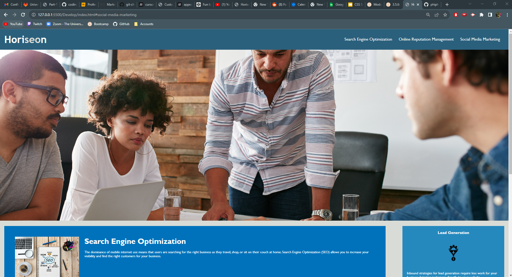
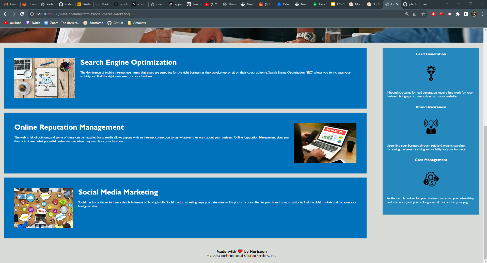

# Challenge 1: Refactoring

## Description

Provide a short description explaining the what, why, and how of your project. Use the following questions as a guide:

- What was your motivation?
- Why did you build this project? (Note: the answer is not "Because it was a homework assignment.")
- What problem does it solve?
- What did you learn?

My ultimate goal is to improve my knowledge of code and structuring of HTML, javascript, and CSS. By challenging myself with refactoring this codebase, it tests my capabilities and improves my 
skills. This projects purpose was to see how well I can consolidate code and make it more efficient before it is out in production, and I feel like it has honed my abilities even more. I learned
to not be repetetive with classes and be more descriptive with tags, using semantic HTML.

What was changed?
- id was added to each article to fix the Navigation bar
- CSS was consolidated and annotated with comments
- HTML Tags were replaced with semantic HTML
- A title was added
- alt text was added to each image

## Installation

To install the project, clone the repository onto your PC.
Enter the directory that has the cloned repository and open (Double click) the index.html and style.css files to read the code and access the files.

## Usage

There are three interactive links in the Navigation Bar in the upper right corner. Each link, Search Engine Optimization, Online Reputation Management, and Social Media Marketing,
will send the user down the webpage to more information. For the rest of the page, the text can be read and the webpage can be scrolled through.

## License

MIT License

Copyright (c) [year] [fullname]

Permission is hereby granted, free of charge, to any person obtaining a copy
of this software and associated documentation files (the "Software"), to deal
in the Software without restriction, including without limitation the rights
to use, copy, modify, merge, publish, distribute, sublicense, and/or sell
copies of the Software, and to permit persons to whom the Software is
furnished to do so, subject to the following conditions:

The above copyright notice and this permission notice shall be included in all
copies or substantial portions of the Software.

THE SOFTWARE IS PROVIDED "AS IS", WITHOUT WARRANTY OF ANY KIND, EXPRESS OR
IMPLIED, INCLUDING BUT NOT LIMITED TO THE WARRANTIES OF MERCHANTABILITY,
FITNESS FOR A PARTICULAR PURPOSE AND NONINFRINGEMENT. IN NO EVENT SHALL THE
AUTHORS OR COPYRIGHT HOLDERS BE LIABLE FOR ANY CLAIM, DAMAGES OR OTHER
LIABILITY, WHETHER IN AN ACTION OF CONTRACT, TORT OR OTHERWISE, ARISING FROM,
OUT OF OR IN CONNECTION WITH THE SOFTWARE OR THE USE OR OTHER DEALINGS IN THE
SOFTWARE.
